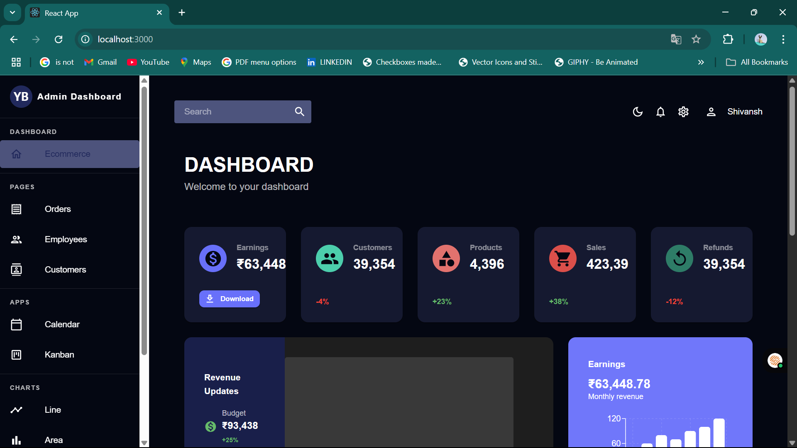
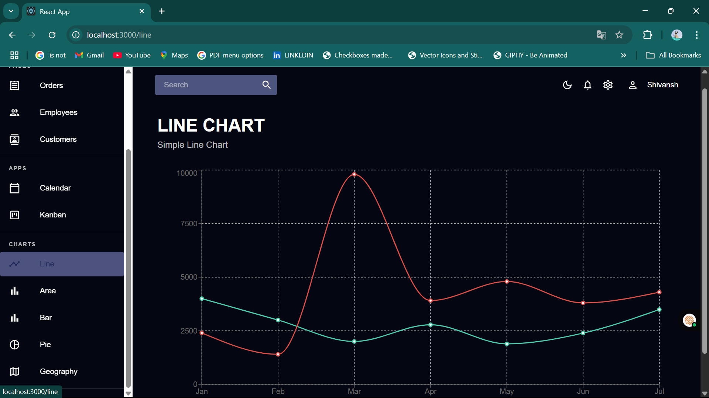
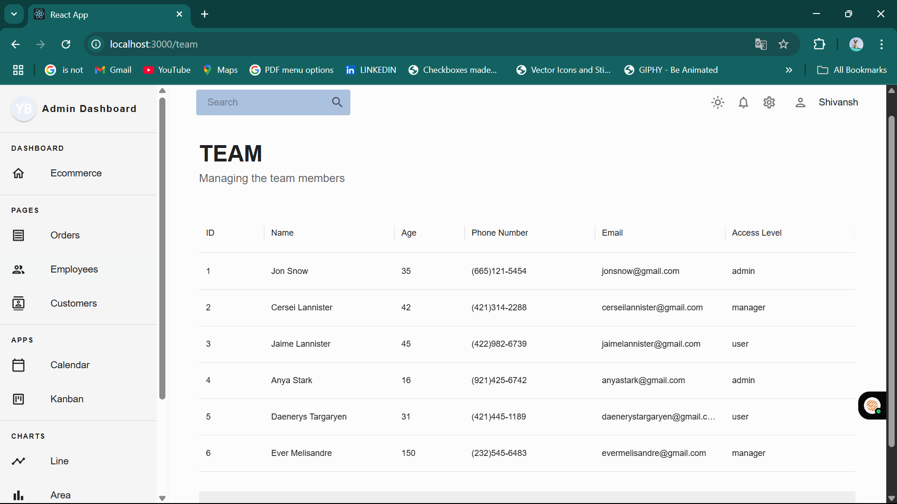
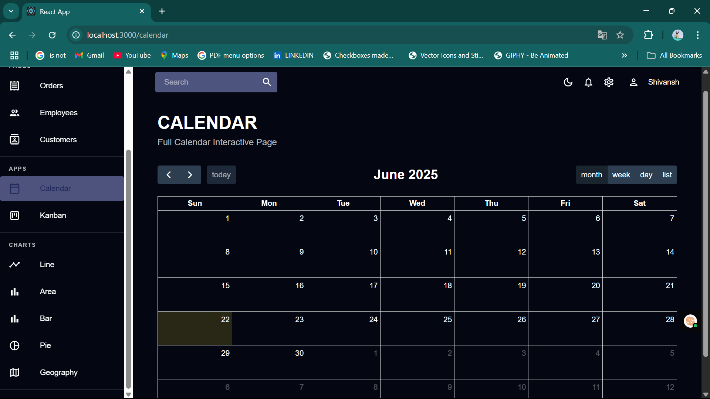

# React Admin Dashboard

## 📸 Screenshots

### Dashboard (Dark Mode)


### Dashboard (Light Mode)


### Line Chart (Dark Mode)


### Team Table (Light Mode)


### Calendar (Dark Mode)


---

A modern, professional, and fully customizable React Admin Dashboard featuring light/dark themes, interactive tables, charts, calendar, Kanban board, and widgets. Built with Material-UI, Recharts, and FullCalendar for seamless integration and a smooth user experience.

---

## 🚀 Features

- **Customizable Themes:** Light/dark mode toggle, easy color palette changes, theme-aware UI.
- **Interactive Dashboard:** Stat cards, revenue/earnings charts, recent activity, to-do, and notifications widgets.
- **Data Tables:** Team, Contacts, Invoices—sortable, filterable, and styled with MUI DataGrid.
- **Charts:** Bar, Line, Pie charts (Recharts), all responsive and theme-aware.
- **Calendar:** Full-featured event calendar (FullCalendar) with theme integration.
- **Kanban Board:** Drag-and-drop task management (react-beautiful-dnd), theme-aware.
- **Navigation:** Sidebar with grouped links, Topbar with search, theme toggle, and user actions.
- **Responsive & Accessible:** Works on all screen sizes, accessible color contrast, keyboard navigation.

---

## 🛠️ Getting Started

1. **Clone the repository**
   ```bash
   git clone <repository-url>
   cd dashboard
   ```
2. **Install dependencies**
   ```bash
   npm install
   ```
3. **Start the development server**
   ```bash
   npm start
   ```
4. **Open your browser**
   Navigate to `http://localhost:3000`

---

## 🎨 Theme Customization

- **Change Theme Colors:**
  - Edit `src/theme/theme.js` to adjust color tokens and palette.
  - All components use theme colors—no hardcoded values.
- **Light/Dark Mode:**
  - Use the sun/moon toggle in the Topbar to switch instantly.
- **Branding:**
  - Replace the logo and app name in `src/components/Sidebar.jsx`.

---

## ➕ Adding Pages or Widgets

1. **Add a New Page:**
   - Create a new folder in `src/scenes/` (e.g., `myPage/`).
   - Add your React component(s).
   - Add a route in `src/App.js` and a link in `Sidebar.jsx`.
2. **Add a Widget to Dashboard:**
   - Edit `src/scenes/dashboard/index.jsx`.
   - Use MUI `Card`, `Grid`, and theme colors for consistency.

---

## 📈 Data & Integration

- **Mock Data:**
  - All tables, charts, and widgets use mock data for demo purposes.
- **Connect to Real Data:**
  - Replace mock data with API calls or your backend logic as needed.

---

## 🏁 Production Tips

- Run `npm run build` to create a production build.
- Review and update dependencies for security and performance.
- Test in both light and dark modes for best results.
- Use environment variables for API endpoints and secrets.

---

## 🤝 Contributing

1. Fork the repository
2. Create a feature branch
3. Make your changes
4. Test thoroughly
5. Submit a pull request

---

## 📄 License

This project is licensed under the MIT License.

---

## 💬 Support

For questions or support, open an issue in the repository.
